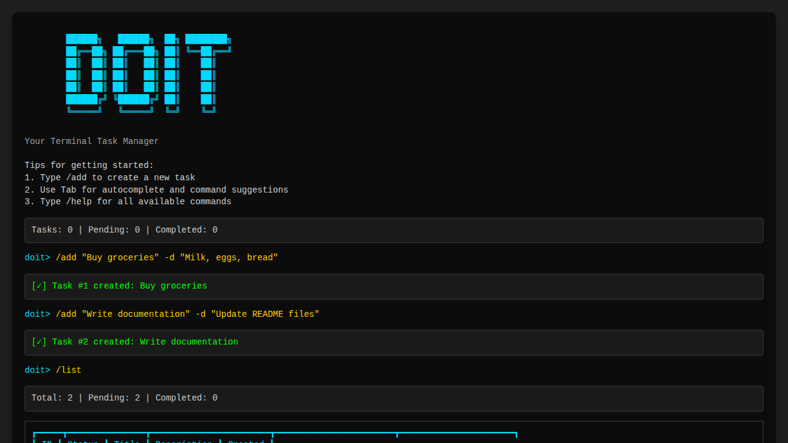

# DoIt - Terminal Task Manager



## Overview

**DoIt** is a modern, beautiful command-line task management application built with Python 3.13+. It provides an elegant terminal interface for managing your daily tasks with features like smart autocomplete, slash commands, and a polished user experience inspired by modern CLI tools.

The application offers a lightweight, in-memory task management solution with an intuitive interface that makes task management effortless. Whether you're organizing your daily todos or learning clean code principles in Python, DoIt delivers a fast and beautiful experience directly in your terminal.

## Key Features

### 🎨 Beautiful Terminal UI
- Rich colors, panels, and formatted output using the Rich library
- Gradient ASCII art logo with eye-catching design
- Clean, organized table layouts for task lists
- Visual status indicators distinguishing completed and pending tasks

### ⚡ Smart Autocomplete
- Tab completion with command templates and placeholders
- Dropdown command suggestions as you type
- Intelligent filtering of commands based on input
- Template insertion for quick command entry

### 💬 Slash Commands
- Intuitive `/command` syntax for all operations
- Easy-to-remember command structure
- Comprehensive command set for full CRUD operations
- Helpful inline descriptions for each command

### 🚀 Lightning Fast Performance
- In-memory storage for instant responses
- No database overhead or setup required
- Handles large task lists (1000+) without performance degradation
- Real-time task statistics in the bottom toolbar

### 🎯 Interactive Mode
- Arrow key navigation for task selection
- Visual task selection interface
- Interactive prompts for all operations
- Multi-task creation mode for batch entry

## Available Commands

| Command | Description | Example |
|---------|-------------|---------|
| `/add "<title>" -d "<desc>"` | Add a new task with title and optional description | `/add "Buy milk" -d "2% organic"` |
| `/add --multi` | Add multiple tasks in one session with guided prompts | `/add --multi` |
| `/list [filter]` | List all tasks with optional filter (all/pending/completed) | `/list pending` |
| `/complete [id]` | Toggle task completion status (interactive if no ID provided) | `/complete 1` |
| `/update <id>` | Update task title and/or description (interactive mode) | `/update 1 -t "New title"` |
| `/delete <id>` | Delete a task with confirmation prompt | `/delete 1` |
| `/clear` | Clear screen and show hero screen | `/clear` |
| `/help` | Display help with all available commands | `/help` |
| `/quit` or `/exit` | Exit the application | `/quit` |

## Quick Start

### Installation

```bash
# Clone the repository
git clone https://github.com/anasahmed07/doit.git
cd doit/doit-cli

# Install dependencies (using uv - recommended)
uv sync
# Install the applicaation
uv tool install .
```

### Running the Application

```bash
doit
```

You'll be greeted with the DoIt hero screen showing the ASCII art logo, helpful tips, and current task statistics.

## Usage Examples

### Adding Tasks

```bash
doit> /add "Buy groceries" -d "Milk, eggs, bread"
```

The application displays a brief loading spinner and confirms task creation:

```
╭──────────────────────────────────────────────╮
│ [✓] Task #1 created: Buy groceries          │
╰──────────────────────────────────────────────╯
```

### Listing Tasks

```bash
doit> /list
```

Displays all tasks in a beautiful table format with columns for ID, Status, Title, Description, and Creation timestamp.

### Interactive Task Completion

Run `/complete` without an ID to access the interactive selection interface:

```bash
doit> /complete
```

Navigate with arrow keys, toggle with Space, and save with Enter.

### Multi-Task Creation

```bash
doit> /add --multi
```

Enter multiple tasks one by one, with the application prompting for title and description for each task. Press Ctrl+D (or Ctrl+Z on Windows) when finished.

## Technical Details

### Architecture

- **Clean Code Structure**: Organized into models, services, and storage layers
- **Type Safety**: Fully typed Python with mypy validation
- **Comprehensive Testing**: 30/30 tests passing with full coverage
- **Modern Dependencies**: Built with Rich (terminal UI) and prompt-toolkit (interactive prompts)

### Storage

Tasks are stored in memory during the active session, making the application:
- Extremely fast with instant response times
- Zero configuration required
- Perfect for quick task organization
- Ideal for learning and prototyping

### Platform Support

DoIt works seamlessly across all major platforms:
- ✅ **Windows** - Windows Terminal, PowerShell, CMD
- ✅ **macOS** - Terminal.app, iTerm2, Alacritty
- ✅ **Linux** - Any terminal with 256-color support

## Design Philosophy

DoIt is built with these core principles:

- **Simplicity First** - Clean, focused interface without bloat
- **Keyboard-Driven** - Everything accessible via keyboard shortcuts
- **Beautiful Output** - Modern terminal aesthetics with Rich library
- **Fast & Lightweight** - In-memory storage for instant responses
- **Developer-Friendly** - Clean architecture, typed Python, comprehensive tests
- **Zero Configuration** - Works out of the box, no setup required

## Documentation

- **User Guide**: See the main [README.md](../doit-cli/README.md) in the doit-cli folder for detailed usage instructions
- **Specifications**: Check the [specs](../specs/001-todo-cli-app/) folder for detailed feature specifications and requirements
- **Development**: Refer to development guides for contributing guidelines

## Technology Stack

- **Python 3.13+** - Latest Python features and performance improvements
- **Rich** - Terminal formatting, colors, and beautiful output
- **prompt-toolkit** - Interactive prompts and smart autocomplete
- **pytest** - Comprehensive testing framework
- **mypy** - Static type checking for code quality
- **ruff** - Fast linting and code formatting

## Use Cases

- **Daily Task Management** - Quick capture and organization of daily todos
- **Learning Tool** - Example of clean code principles in Python
- **Development** - Foundation for building more complex task management systems
- **Productivity** - Lightweight alternative to heavy task management apps
- **Prototyping** - Rapid workflow experimentation without database setup

## License

This project is licensed under the MIT License - see the [LICENSE](../LICENSE) file for details.

---

**Made with ❤️ and Python 3.13+**
